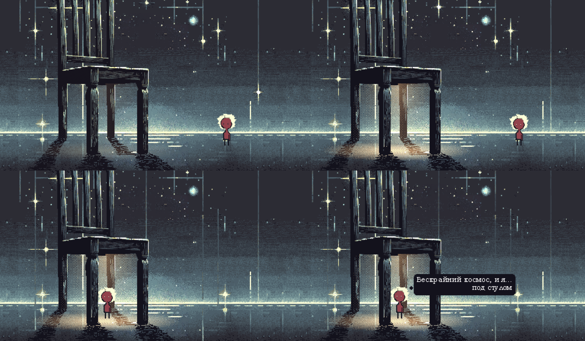

# Журнал дизайна — Фотон

> Кадры и слова автора о том, что он увидел. Правило Сада для каждого проекта с картинкой: решение по виду —
> вместе с кадром и его словами, свежее сверху. Заведён 2026-10-06.

## 2026-10-06 — сцена 2 как игра, первая версия

Что было: наведение на стул — стул светлеет, под сиденьем едва теплеет · щелчок — тёплый свет ступенями ·
Фотон сам идёт на тепло · реплика по буквам · левый край — гаснет. Фон и дождь — кольцом из ролика автора.

**Автор:** «круто что ты это сделал всё! невероятно! но пока что ощущение не очень.. дерганный задник,
бессмысленные нажатия, отсутствие смысла и интереса».

Разбор Клода:
- **Задник дёргается** — кольцо: куски ролика, которые у автора шли один раз (звезда в небе — x 228–370,
  верх кадра; дорожки капель), раз в ~17–18 с срываются в начало. И дождь — 5 кадров в секунду, как в ролике.
- **Нажатия бессмысленны** — игрок сделан выключателем: навёл, щёлкнул, свет. Зачем стул, откуда тепло, при чём
  тут игрок — сцена не отвечает. Фотону в ней не холодно и не одиноко, поэтому тепло ничего не значит: сцена
  ровная, всё одного веса. Расходится с решениями автора: игрок — спутник Фотона (15.12.2024), смысл сцены —
  уют на контрасте с холодом (README).
- Вывод: до новой сборки — драматургия сцены (что чувствует игрок и почему), потом форма.

**Автор, следом:** «до левой границы как ты говорил нажать не получается — нажимаю на стул, запускается сцена
прохода под стул, потом экран гаснет. смотри… ту сцену в виде [ролика] я собрал только для того, чтобы что-то
сделать. чтобы была завершённость, чтобы я потом мог вернуться к чему-то ощутимому».
- Левый край срабатывал касанием, без нажатия — затемнение приходило неожиданно, без действия игрока.
- Главное: ролик со стулом — веха для завершённости, а не образец сцены. Клод взял его за основу и оживлял
  веху, а не замысел.
